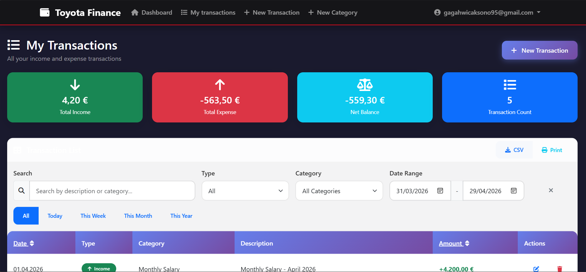

# Personal Finance Tracker

A web-based personal and company financial management application built with **ASP.NET Core 9 MVC** and **SQL Server**. Track your income and expenses, manage custom categories, and monitor your financial health through an interactive dashboard.

---

## Screenshots

### Home Page


### My Transactions


---

## Features

- **Authentication** — Secure user registration and login via ASP.NET Core Identity
- **Dashboard** — Financial summary with total income, expense, net balance, and monthly breakdowns
- **Transaction Management** — Add, edit, and delete income/expense transactions
- **Category Management** — Create custom categories scoped per user for Income and Expense types
- **Transaction List** — Filter by type, category, date range, and keyword search
- **Quick Filters** — View transactions by Today, This Week, This Month, This Year
- **Export & Print** — Export transaction data to CSV or print directly from the browser
- **Multi-user Support** — Each user's data is fully isolated

---

## Tech Stack

| Layer | Technology |
|-------|-----------|
| Framework | ASP.NET Core 9 MVC |
| Language | C# (.NET 9) |
| Database | SQL Server (via EF Core 9) |
| ORM | Entity Framework Core 9 |
| Authentication | ASP.NET Core Identity |
| Frontend | Bootstrap 5, jQuery |
| Architecture | Repository + Service pattern |

---

## Project Structure

```
PersonalFinancialSystem/
├── Controllers/            # MVC Controllers (Dashboard, Transaction, Category)
├── Data/
│   ├── ApplicationDbContext.cs
│   └── Migrations/         # EF Core migrations
├── Interfaces/             # Service and Repository interfaces
├── Models/
│   ├── TransactionModel.cs
│   ├── CategoryModel.cs
│   ├── DTOs/
│   └── ViewModels/
├── Repository/             # Data access layer
├── Service/                # Business logic layer
├── Views/                  # Razor views
│   ├── Dashboard/
│   ├── Transaction/
│   ├── Category/
│   └── Shared/
└── wwwroot/                # Static assets (CSS, JS, lib)
```

---

## Getting Started

### Prerequisites

- [.NET 9 SDK](https://dotnet.microsoft.com/download/dotnet/9.0)
- [SQL Server](https://www.microsoft.com/en-us/sql-server/sql-server-downloads) (Express or higher)
- [Visual Studio 2022](https://visualstudio.microsoft.com/) or VS Code

### 1. Clone the Repository

```bash
git clone https://github.com/gagahhwck/Personal-Financial-System.git
cd "Personal-Financial-System"
```

### 2. Configure the Database Connection

Open `appsettings.json` and update the connection string to match your SQL Server instance:

```json
{
  "ConnectionStrings": {
    "DefaultConnection": "Server=localhost;Database=PersonalFinanceDb;Trusted_Connection=True;TrustServerCertificate=True;"
  }
}
```

> For SQL Server authentication, use:
> ```
> Server=localhost;Database=PersonalFinanceDb;User Id=your_user;Password=your_password;TrustServerCertificate=True;
> ```

### 3. Apply Database Migrations

Run the following command from the project root to create the database and apply all migrations:

```bash
dotnet ef database update
```

### 4. Run the Application

```bash
dotnet run
```

Or press **F5** in Visual Studio. The application will be available at `https://localhost:xxxx`.

---

## Database Migrations

| Migration | Description |
|-----------|-------------|
| `CreateIdentitySchema` | ASP.NET Core Identity tables |
| `InitialCreate` | Initial database schema |
| `transactionandcategories` | Transaction and Category tables |
| `categorymodelupdate` | Category model update |

To add a new migration after model changes:

```bash
dotnet ef migrations add MigrationName
dotnet ef database update
```

---

## Data Models

### TransactionModel

| Field | Type | Description |
|-------|------|-------------|
| `Id` | int | Primary key |
| `Amount` | decimal | Transaction amount |
| `Description` | string | Transaction notes |
| `TransactionDate` | DateTime | Date of transaction |
| `TransactionType` | int | `1` = Income, `2` = Expense |
| `CategoryId` | int | Foreign key to Category |
| `UserId` | string | Owner (Identity user ID) |
| `CreatedDate` | DateTime | Record creation timestamp |

### CategoryModel

| Field | Type | Description |
|-------|------|-------------|
| `Id` | int | Primary key |
| `Name` | string | Category name |
| `TransactionType` | int | `1` = Income, `2` = Expense |
| `UserId` | string | Owner (Identity user ID) |

---

## Seed Data

SQL seed scripts are located in the `PersonalFinance/` folder:

- `demo.sql` — Sample demo data
- `seed_toyota.sql` — Toyota-themed sample data
- `seed_toyota_reset.sql` — Reset and reseed script

---

## Security

- All routes require authentication (`[Authorize]` attribute on all controllers)
- Data is scoped to the authenticated user via `UserId` — users cannot access each other's data
- Email confirmation is required for new accounts (`RequireConfirmedAccount = true`)
- HTTPS is enforced in production (`UseHttpsRedirection`, `UseHsts`)

---

## Dependencies

```xml
Microsoft.AspNetCore.Diagnostics.EntityFrameworkCore  9.0.0
Microsoft.AspNetCore.Identity.EntityFrameworkCore     9.0.0
Microsoft.AspNetCore.Identity.UI                      9.0.0
Microsoft.EntityFrameworkCore.SqlServer               9.0.6
Microsoft.EntityFrameworkCore.Tools                   9.0.6
```

---

## Author

**gagahhwck**
- GitHub: [@gagahhwck](https://github.com/gagahhwck)
- Repository: [Personal-Financial-System](https://github.com/gagahhwck/Personal-Financial-System)

---

## License

This project is intended for personal and educational use.
